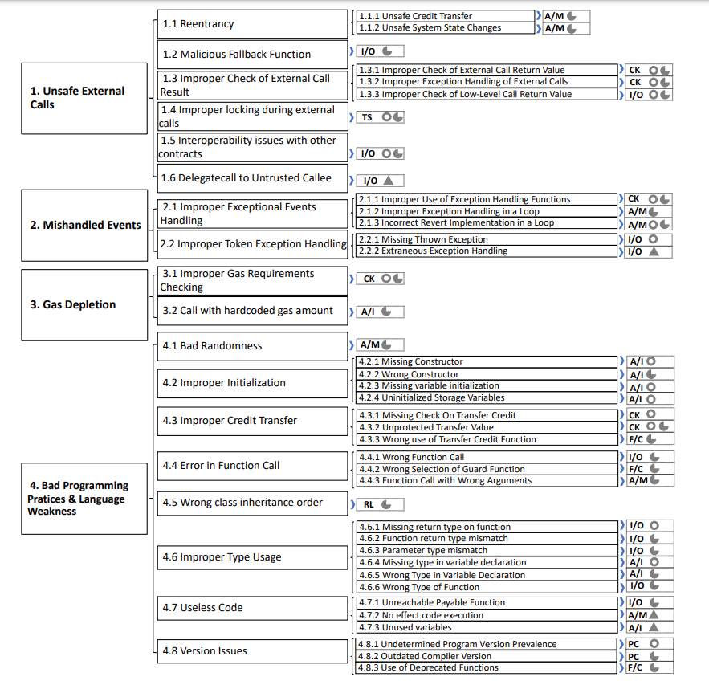
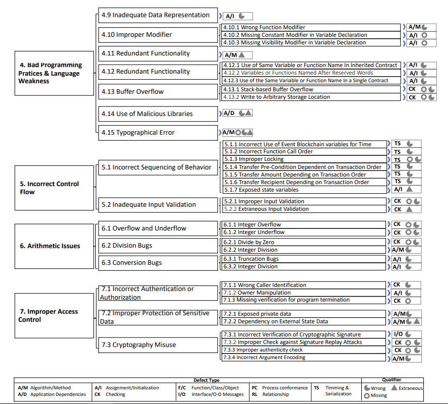
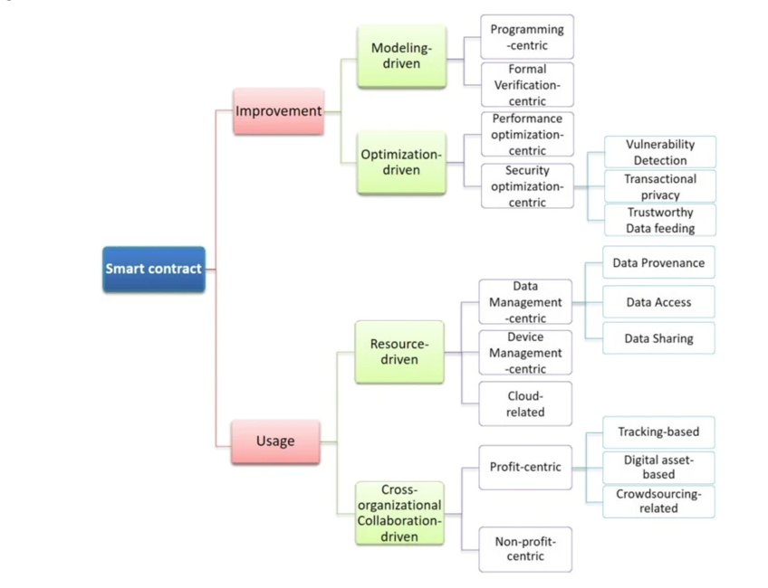
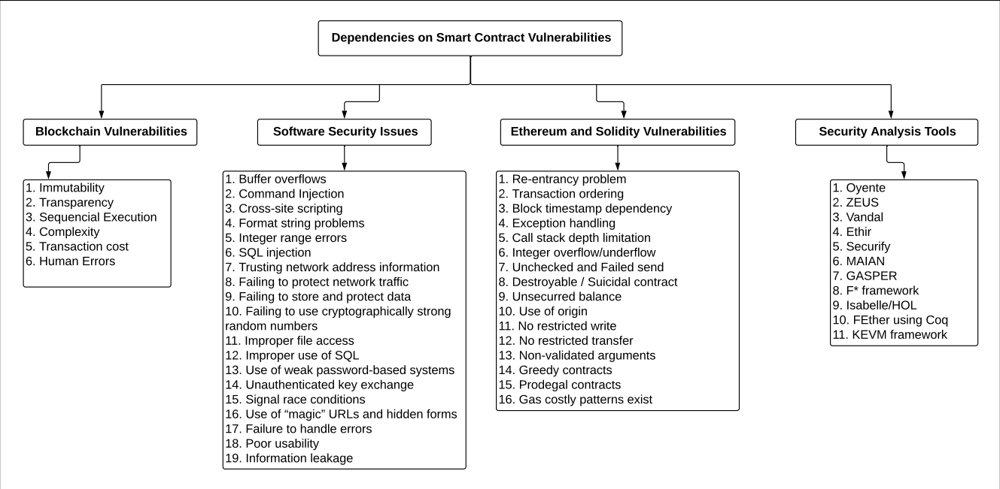
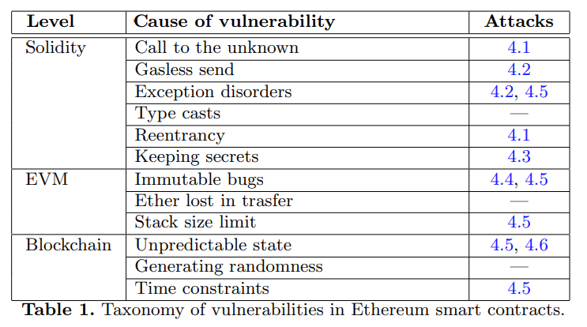

[role="pagenumrestart"]
[[flaws_article]]
= Analysis of previous research on smart contract security flaws
This section contains all the article I found with a short summary in order to find overlooked area.

[[article_summary]]
== Previous research

Demystifying Random Number in Ethereum Smart Contract:: https://arxiv.org/pdf/2304.12645.pdf

Date: 25 April 2023

Subject covered: Reviewing different way to generate random number using ethereum EVM.

OpenSCV: An Open Hierarchical Taxonomy for Smart Contract Vulnerabilities:: https://arxiv.org/pdf/2303.14523.pdf

Date: 7th april 2023

Subject covered: Proposition of a new open source taxonomy based on historical ones.

A Source-Code-­Based Taxonomy for Ethereum Smart Contracts:: https://www.researchgate.net/profile/Adrian-Hofmann-3/publication/354901921_A_Source-Code-Based_Taxonomy_for_Ethereum_Smart_Contracts/links/6153537139b8157d9003f2fc/A-Source-Code-Based-Taxonomy-for-Ethereum-Smart-Contracts.pdf

Date: 2021

Subject covered: Classifies smart contracts on multiple charachteritics.

Maybe correlate to vulnerabilities ?

Blockchain smart contracts: Applications, challenges, and future trends:: https://link.springer.com/article/10.1007/s12083-021-01127-0#Sec5

Date: 18th April 2021

Subject covered: Systematic Literature Review on smart contract research

Taxonomy of existing research  

This paper is a usefull source of article concerning smart contract flaws and taxonomy.

Smart Contract: Attacks and Protections:: https://arxiv.org/pdf/2303.14523.pdf

Date: 10th February 2020

Subject covered: Explain differents smart contract flaws based on other research.

reentrancy,overflow, short address, delegatecall, default visibilities, TOD, timestamp dependence

Security Analysis Methods on Ethereum Smart Contract Vulnerabilities — A Survey:: https://arxiv.org/pdf/1908.08605.pdf

Date: 16th september 2020

Subject covered: The artlicle propose a taxonomy of smart contract security flaws

Explanation in depth of vulnerabilities, potential fix and real examples. There is also a part on analysis tools that I cover this https://github.com/Longferret/smart_contract_tax/blob/main/tools_article.adoc[section].

An Overview on Smart Contracts: Challenges, Advances and Platforms:: https://arxiv.org/pdf/1912.10370.pdf

Date: 22th december 2019

Subject covered: The article is a summary of advances of past reasearch on smart contract.

They also classifies the diffenrent dApps types and show their benefits and usecase.

NCC Group taxonomy:: https://dasp.co/

Date: 2018

Subject covered: It is a simple old taxonomy but clear.

An empirical analysis of smart contracts: platforms, applications, and design patterns:: https://arxiv.org/pdf/1703.06322.pdf

Date: 18th march 2017

Subject covered: The article is an empirical analysis on smart contract types.

A survey of attacks on Ethereum smart contracts:: https://eprint.iacr.org/2016/1007.pdf

Date: 28th March 2017

Subject covered: Simple taxonomy with examples

Game examples to explain how to attack using presented vulnerabilities:

not checking send return value,
data is not totaly private on blockchain, name change not constructor (rly dumb), DAO attack

Step by Step Towards Creating a Safe Smart Contract: Lessons and Insights from a Cryptocurrency Lab:: https://eprint.iacr.org/2015/460.pdf

Date: 18th november 2015

Subject covered: The authors asked students to write smart contracts, observed their security flaws and patch them.

They also propose a course on ethereum smart contracts with examples
https://github.com/mc2-umd/ethereumlab

[[other_flaw]]
=== Others
Smart Contract: A Literature-Based Analysis and Development of a Taxonomy Framework:: https://link.springer.com/chapter/10.1007/978-3-030-85843-8_4

When ChatGPT Meets Smart Contract Vulnerability:: https://arxiv.org/pdf/2309.05520.pdf

Detecting Vulnerabilities in Smart Contracts with Deep Transfer Learning:: https://www.ndss-symposium.org/wp-content/uploads/2023/02/ndss2023_s263_paper.pdf

A Smart Contract Vulnerability Detection Mechanism Based on Deep Learning and Expert Rules:: https://ieeexplore.ieee.org/stamp/stamp.jsp?arnumber=10190630

ASSBert: Active and semi-supervised bert for smart contract vulnerability detection:: https://www.sciencedirect.com/science/article/abs/pii/S221421262300008X

When GPT Meets Program Analysis:: https://arxiv.org/pdf/2308.03314.pdf

A novel extended multimodal AI framework towards vulnerability detection in smart contracts:: https://www.sciencedirect.com/science/article/abs/pii/S0020025523004565

[[vulnerable_contracts]]
=== Collection of vulnerable contract
In addtion to parsing the blockchain and get the data in bytecode, I post here collections done of known vulnerable smart contracts in solidity and/or bytecode.

143 vulnerable smart contracts (+fix)::
https://github.com/smartbugs/smartbugs-curated/tree/main/dataset

12 vulnerable smart contracts (+fix)::
https://github.com/crytic/not-so-smart-contracts

Collection of 186 397 smart contracts that have a least one transaction (1st of April 2022):: https://paperswithcode.com/dataset/verified-smart-contracts

609 vulnerable smart contracts::
https://figshare.com/articles/dataset/Vulnerable_Verified_Smart_Contracts/21990287

from the article: https://arxiv.org/pdf/1910.10601.pdf

The article propose a transformer-based large language model to detect vulnerable code and propose solutions.

[[overlooked_area]]
=== Overlooked area and possible contribution
I remark that collection of vulnerable smart contract are hard to find, creating a database filled with smart contracts and their potential fix could be interresting.

Example: Getting all (active?) smart contract on the ethereum blockchain, try to find vulnerabilities with bytecode signature or an analysis tool and finally recover solidity code from etherscan.

The different taxonomies of vulnerabilities are all differents and subjectives, it is hard to propose or see change that could be done.

The lack of good practice guide, tutorials are everywhere but there are few advanced tutorials to code advanced feature in solidity.

Example: Code a dApp feature (like a DAO,..) and show potiential vulnerabilities and how to avoid them

A Mixed-Methods Study of Security Practices
of Smart Contract Developers (https://www.usenix.org/system/files/usenixsecurity23-sharma.pdf)